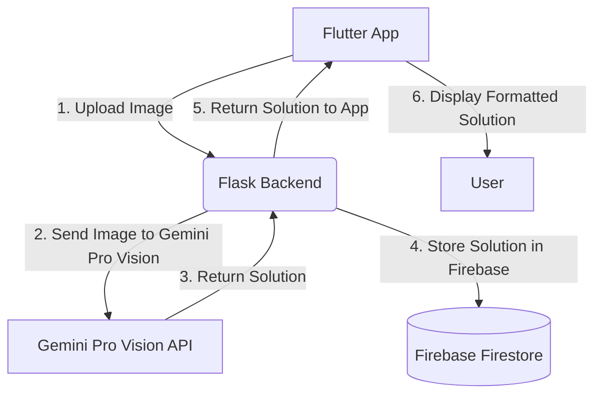

# Math Homework Solver

This project is a Flutter application with a Flask and Firebase backend designed to help students solve their math homework problems. Users can upload an image of a math problem, and the system will provide a step-by-step solution.

## Table of Contents

- [Project Overview](#project-overview)
- [Architecture](#architecture)
- [Features](#features)
- [Technologies Used](#technologies-used)
- [Setup and Installation](#setup-and-installation)
- [Running the Application](#running-the-application)
- [Project Structure](#project-structure)

## Project Overview

The goal of this project is to provide a simple and intuitive tool for students to get help with their math homework. By leveraging modern technologies like Flutter for the frontend and a powerful combination of Flask, Firebase, and Google's Gemini Pro Vision for the backend, the application can analyze images of math problems and generate detailed, easy-to-understand solutions.

## Architecture

The application follows a client-server architecture:

-   **Frontend (Client):** A cross-platform mobile application built with Flutter that allows users to select an image and display the solution.
-   **Backend (Server):** A Python Flask server that handles image uploads, processes the images using the Gemini Pro Vision API, and stores the results in a Firebase Firestore database.

Here is a diagram of the high-level architecture:



## Features

-   Upload a math problem by selecting an image from the gallery.
-   Receive a detailed, step-by-step solution.
-   Solutions are displayed in a clean, readable format.
-   Cross-platform support (Android, iOS, and Web).

## Technologies Used

-   **Frontend:**
    -   [Flutter](https://flutter.dev/): For building the cross-platform mobile and web application.
    -   [Dart](https://dart.dev/): The programming language for Flutter.
-   **Backend:**
    -   [Python](https://www.python.org/): The programming language for the backend.
    -   [Flask](https://flask.palletsprojects.com/): A lightweight web framework for the backend server.
    -   [Google Gemini Pro Vision](https://ai.google.dev/): For analyzing the images and solving the math problems.
    -   [Firebase Firestore](https://firebase.google.com/docs/firestore): A NoSQL database for storing the problems and solutions.

## Setup and Installation

To get the project up and running, you will need to set up both the backend and the frontend.

### Prerequisites

-   [Flutter SDK](https://flutter.dev/docs/get-started/install)
-   [Python 3.8+](https://www.python.org/downloads/)
-   A [Firebase](https://console.firebase.google.com/) project
-   A [Google AI API Key](https://aistudio.google.com/)

### Backend Setup

1.  **Navigate to the backend directory:**
    ```bash
    cd src/backend
    ```
2.  **Create a Python virtual environment:**
    ```bash
    python -m venv venv
    ```
3.  **Activate the virtual environment:**
    -   On Windows:
        ```bash
        venv\Scripts\activate
        ```
    -   On macOS/Linux:
        ```bash
        source venv/bin/activate
        ```
4.  **Install the required Python packages:**
    ```bash
    pip install -r requirements.txt
    ```
5.  **Set up Firebase Credentials:**
    -   Go to your Firebase project settings and generate a new private key file for your service account.
    -   Rename the downloaded JSON file to `firebase_credentials.json` and place it in the `src/backend` directory.
6.  **Set up your Gemini API Key:**
    -   Create a file named `.env` in the `src/backend` directory.
    -   Add the following line to the `.env` file, replacing `YOUR_API_KEY` with your actual key:
        ```
        GEMINI_API_KEY=YOUR_API_KEY
        ```

### Frontend Setup

1.  **Navigate to the frontend directory:**
    ```bash
    cd src/frontend
    ```
2.  **Get the Flutter dependencies:**
    ```bash
    flutter pub get
    ```

## Running the Application

You need to run both the backend and frontend servers simultaneously.

### 1. Run the Backend

-   In a terminal, navigate to the `src/backend` directory and run:
    ```bash
    python app.py
    ```
-   The Flask server will start on `http://127.0.0.1:5000`.

### 2. Run the Frontend

-   In a **separate** terminal, navigate to the `src/frontend` directory.
-   **For Web:**
    ```bash
    flutter run -d chrome
    ```
-   **For a Physical Android Device:**
    1.  Connect your device and enable USB debugging.
    2.  Find your computer's local IP address (e.g., `192.168.1.100`).
    3.  In `src/frontend/lib/main.dart`, change the `Uri.parse` line to use your computer's IP:
        ```dart
        Uri.parse('http://YOUR_COMPUTER_IP:5000/upload')
        ```
    4.  Run the app:
        ```bash
        flutter run
        ```

## Project Structure

```
.
├── src/
│   ├── backend/
│   │   ├── app.py                  # Main Flask application
│   │   ├── requirements.txt        # Python dependencies
│   │   ├── firebase_credentials.json # Firebase service account key
│   │   └── .env                    # For API keys
│   └── frontend/
│       ├── lib/
│       │   └── main.dart           # Main Flutter application code
│       └── pubspec.yaml            # Flutter dependencies
├── behavioural_questions.md        # Responses to behavioural questions
└── README.md                       # This file